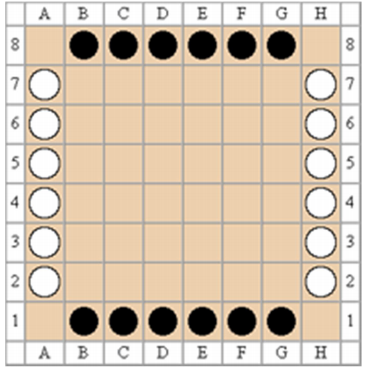

# AI-LOA
### 集结棋(Lines of Action)，简称 LOA，是 Claude Soucie 在 1969 年推出的棋类。
为奥林匹亚电脑游戏程式竞赛的指定棋类之一。棋盘可使用国际象棋棋盘。棋子
各方有十二颗，以两色各代表一方。
----

---
游戏规则：
- 棋局开始时一方棋子摆于棋盘的最底与最上横行，角落不放棋。另一方放于
最右与最左纵列，角落也不放棋。
- 黑方先行，双方交替下棋。
- 一步合法的棋步包括：可沿横、纵、斜线做直线移动至敌棋或空位处，途中
可以穿过己棋，其移动步数必须正好等于该线上所有棋子的总数。
- 若至敌棋处，将后者移出游戏不再使用。
- 如果一方至少有一步合法棋步可下，他就必须落子，不得弃权。
- 棋局持续下去，直到某一方到获胜条件或者双方都无合法棋步可下。
- 如果某一方落子时间超过 1 分钟，则判该方失败。
- 先把棋盘上所有的己棋集合在一起即获胜，不拘形状，斜线相连也算。或者
把对方吃掉只剩一枚敌棋，也即获胜。